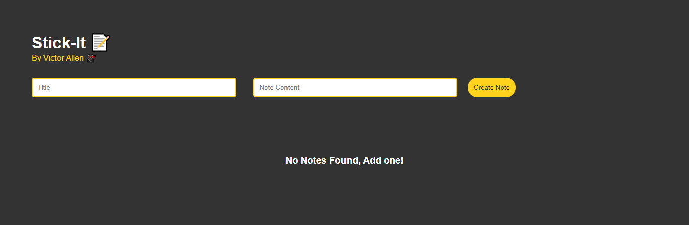

# Stick-it 📝

Want to keep track of your sticky-notes?🤷‍♀️
Stick-it is a progressive web app that allows you to set up sticky notes📝 and have them with you at all times. Want it on mobile📱, laptop💻 or desktop🖥, no problem!😎



## Getting Started

These instructions will get you a copy of the project up and running on your local machine for development and testing purposes. See deployment for notes on how to deploy the project on a live system.

### Prerequisites

What things you need to install the software and how to install them

```
* npm 6.9.0 or latest
* Node.js 10.16.0 or latest
```

### Installing

A step by step series of examples that tell you how to get a development env running

Open Terminal / Command Prompt and type:

```
git clone https://github.com/vamuigua/stick-it.git
```

Then change your directory to the project you have cloned

```
cd stick-it
```

Install npm packages

```
npm install
```

Run 'sw-precache' to automatically generate the service-worker.js file

```
sw-precache
```

Open the index.html on your Browser of choice

```
./index.html
```

Your done...The app should now be running on your browser 👍

## Run App on Android, IOS, Windows etc.

Open the this link [stick-it](https://stick-it-notes.netlify.app/) on your mobile device

At the botton of the screen note the

```
Add Stick-it to Home screen
```

Click Yes, which will install the app to your phone 📱

## Built With

- HTML
- CSS
- JS

## Authors

- **Victor Allen** - [vamuigua](https://github.com/vamuigua) :v:

## License

This project is licensed under the MIT License - see the [LICENSE.md](LICENSE.md) file for details

## Acknowledgments

- **Tharun Shiv** - [tharunShiv](https://github.com/tharunShiv)
